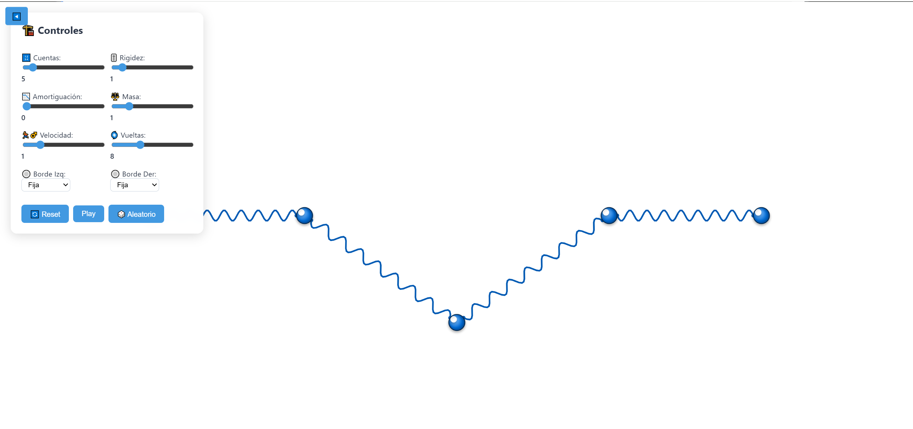

# Simulación de Modos Normales en Cadena de Cuentas

[](https://github.com/tu-usuario/tu-repositorio)
[](https://p5js.org/)

Una simulación interactiva de una cadena de cuentas acopladas por resortes que muestra modos normales de vibración, implementada en p5.js.

 <!-- Agrega tu captura de pantalla aquí -->

## Características Principales

- **Sistema Físico Realista**
  - Integración numérica semi-implícita de Euler
  - Resortes lineales con rigidez ajustable
  - Parámetros configurables: masa, amortiguación, velocidad
  - Condiciones de borde: Fijas, Libres o Periódicas

- **Visualización Avanzada**
  - Cuentas con efecto 3D y reflejos dinámicos
  - Resortes helicoidales estilizados
  - Panel de control colapsable
  - Diseño responsive

- **Interactividad Completa**
  - 3 Modos de operación:
    - 🎮 Manual: Arrastra las cuentas
    - 🧮 Modos Normales: Selección predefinida
    - 🎲 Aleatorio: Configuraciones iniciales random
  - Controles en tiempo real
  - Botones de acción rápida

## Instalación

1. Clona el repositorio:
```bash
git clone https://github.com/tu-usuario/simulacion-cuentas.git